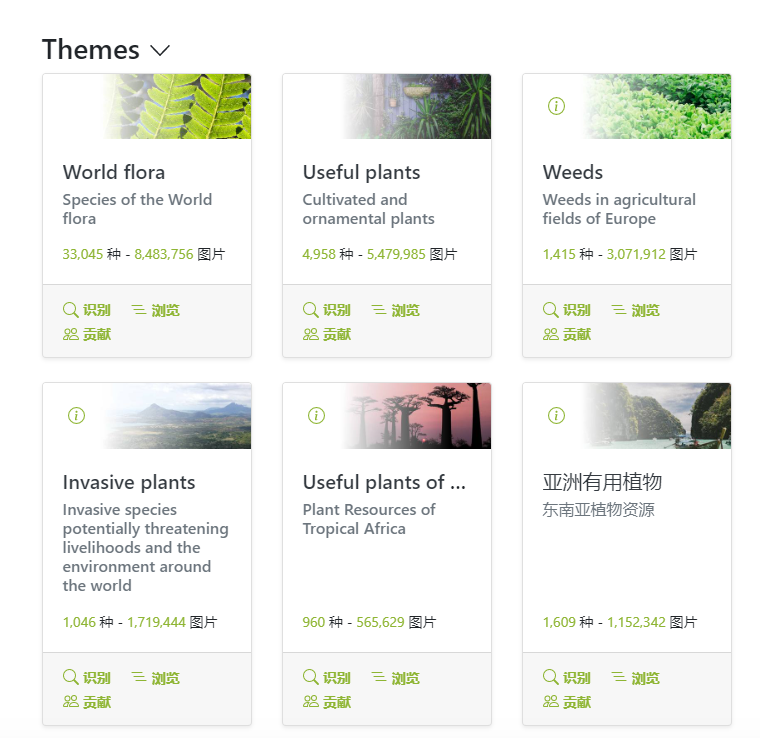

# machine_learning_for_plant

通过机器视觉完成对植物生长状态的评估，同时对植物进行一定的识别分类

## 目标

通过机器视觉完成对植物生长状态的评估，同时对植物进行一定的识别分类

## 预计使用的技术

- OpenCV，经典且广泛流行的计算机视觉库，官方支持C++库，以及python接口，支持多种计算机视觉算法，用于图片的预处理或神经网络的搭建
- PlantCV，plant computer vision，针对植物的开源计算机视觉，参考一些植物相关功能的实现
- 昇思mindspore，华为新开源的深度学习框架，同时配合华为提供的线上平台能获取免费的网络GPU，方便模型的训练
  - 数据集：Pl@antNet叶片库[Pl@ntNet (github.com)](https://github.com/plantnet)
  - 
  - 模型：ResNet520 yolov3 MobileNetV2

## 理论/实例参考

PlantCV

论文：

[1]陈家茜,刘昌华.基于植物图像的甘蓝型油菜叶片面积测量方法[J].武汉轻工大学学报,2021,40(02):18-23.

[1]单治磊. 考虑复杂背景的植物识别算法研究[D].湖北工业大学,2018.

[1]郭臻,陈远知.图像阈值分割算法研究[J].中国传媒大学学报(自然科学版),2008(02):77-82.DOI:10.16196/j.cnki.issn.1673-4793.2008.02.014.

[1]贺鹏,黄林.植物叶片特征提取及识别[J].农机化研究,2008(06):168-170+199.

[1]殷悦,张慧春,郑加强.基于双目立体视觉的植物三维重建系统[J].中国农机化学报,2021,42(03):129-135.DOI:10.13733/j.jcam.issn.2095-5553.2021.03.018.

[1]沈跃,朱嘉慧,刘慧,孙力.基于深度和彩色双信息特征源的Kinect植物图像拼接[J].农业工程学报,2018,34(05):176-182.

[1]徐贵力,毛罕平,胡永光.基于计算机视觉技术参考物法测量叶片面积[J].农业工程学报,2002(01):154-157+3. --

[1]马彦平,白由路,高祥照,卢艳丽,杜君.基于数字图像的玉米叶面积测量方法研究[J].中国农学通报,2009,25(22):329-334. --

[1]张帅. 基于深度学习的植物叶片识别算法研究[D].北京林业大学,2016.

方向--斗南花卉识别

---

基于注意力

农业数字工程